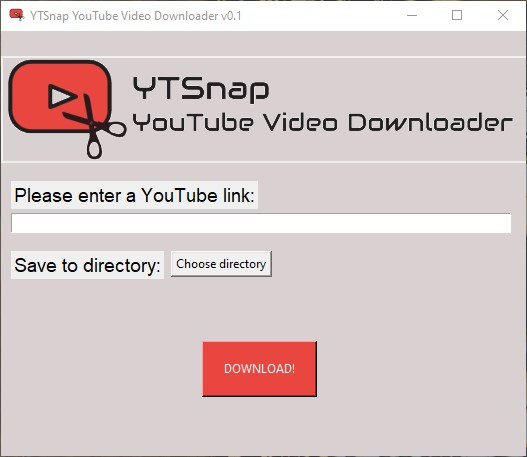

# YTSnap Youtube Video Downloader

This program is a simple YT video downloader written 100% in Python. Libraries used: pytube and tkinter and PIL

## How to use the program?
- download either setup or portable version
- run it
- paste a Youtube video link
- select the directory you want to save the file to, and hit DOWNLOAD! 

Sadly, at the moment you can only download audio. [^1]

[^1]: It's in **.webm** format. (Convertion to .mp3 later)

## Screenshot

